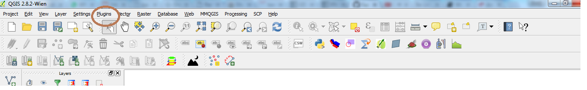

============
Installing QGIS
============

- Go to the QGIS download page `here <http://www.qgis.org/en/site/forusers/download.html>`_
- Download the appropriate standalone install file for QGIS 2.8 under the section marked "Long term release (eg. for corporate users)"

Required Plugins & Installation
-------------------------------

 - Once you have installed QGIS 2.8, click on the plugins option (circled below)-> click on Manage and Install Plugins. (Following bits require internet)

- Search for, and install the following plugins
 + MMQGIS
 + Openlayers
 + Processing
 + Points2One
 + Spatial Query Plugin
 
==============
STATA and QGIS
==============

- In STATA, please install the command `shp2map'
- If we can manage the time, we'll also look at the 'maptile' and 'spmap' commands. 
- Install these commands by entering the following code in the STATA command line, and press enter (requires internet)

.. highlight:: STATA

::

	ssc install shp2map
	ssc install spmap
	ssc install maptile
